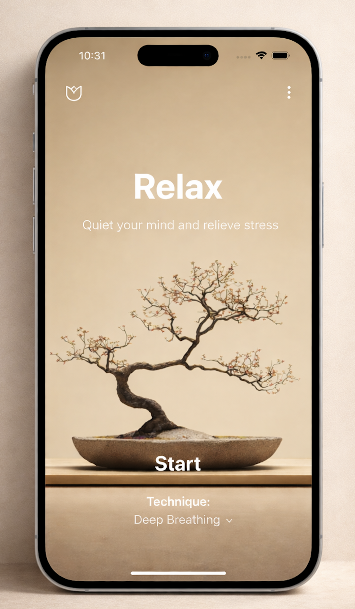
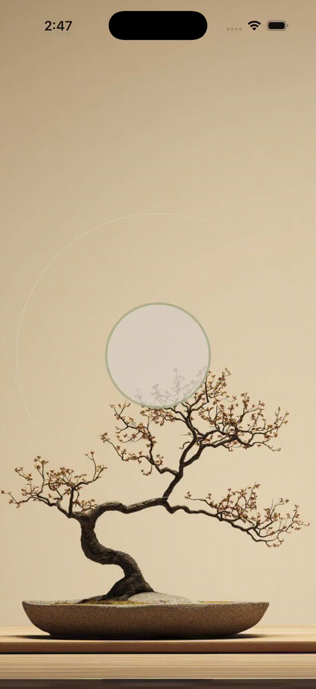
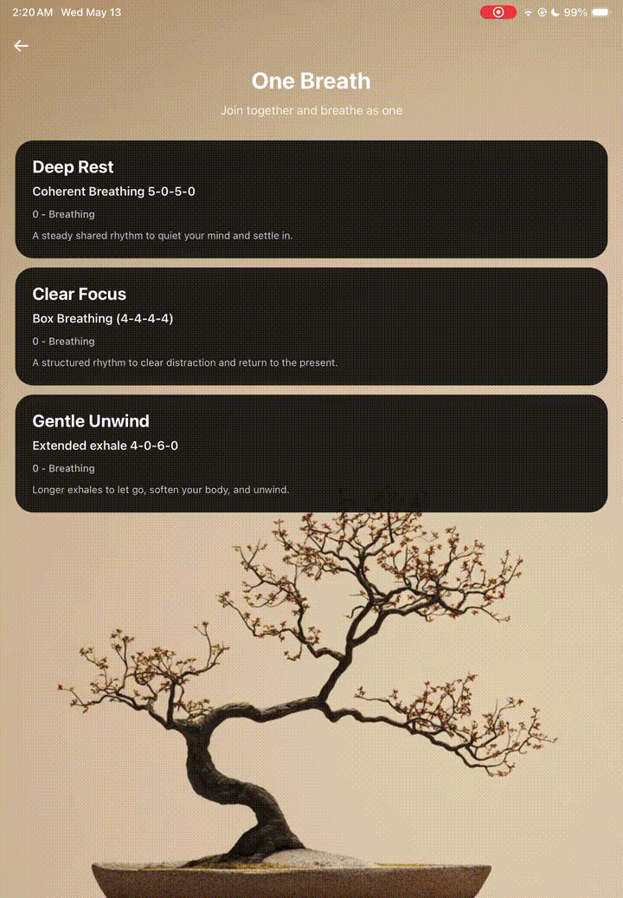
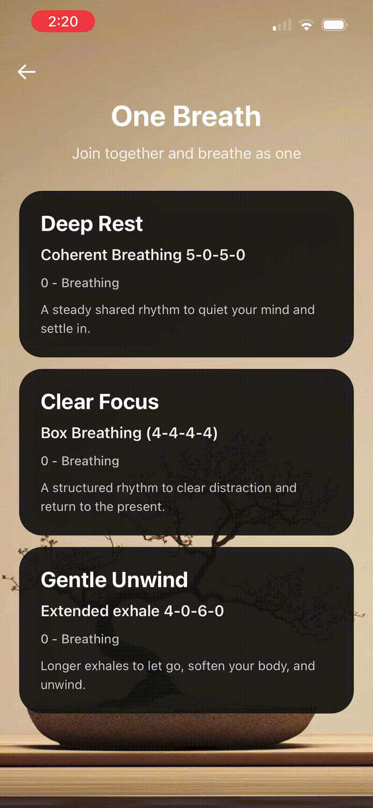
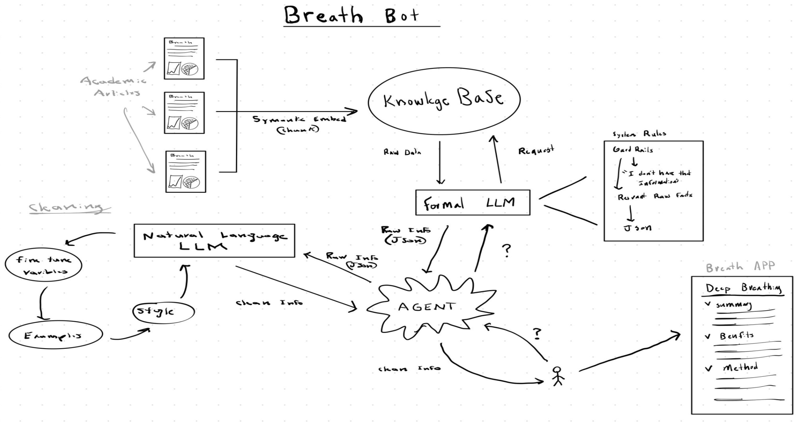
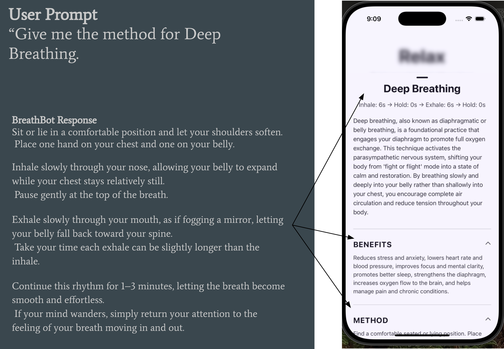
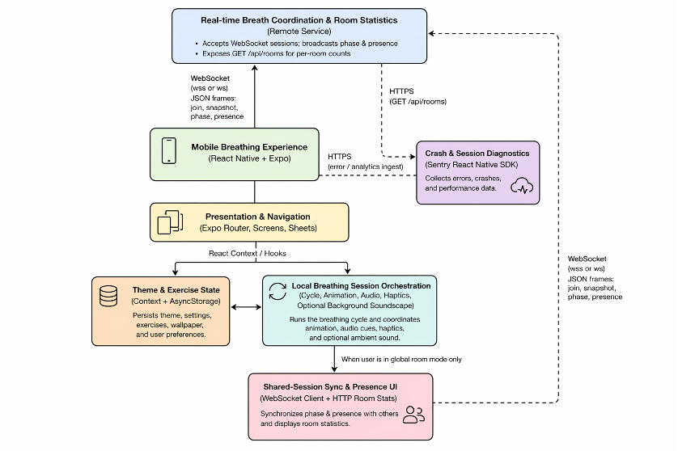
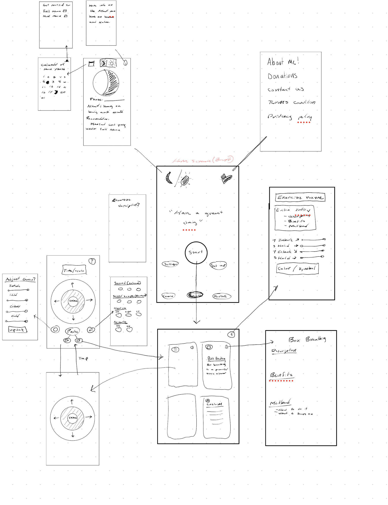
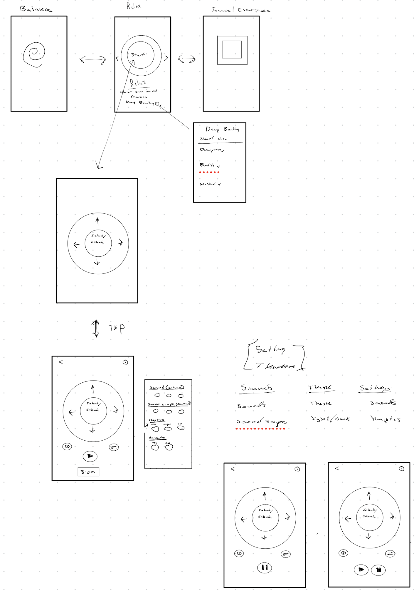

# JustBreatheBro
Mindfulness and breathing mobile app

## Thank you
JustBreatheBro is a personal project that deepened my mindfulness practice and showed me how powerful breathwork can be.

It pushed me to grow as a mindfulness practitioner, musician, artist, and engineer.

I hand-played, recorded, and produced the meditation audio, and I also created the icons, symbols, and custom animations. Along with creating custom hyptics. 

And tied it all together using  software engineering to tie it all together 

This project means a lot to me. Thank you for taking the time to check it out.

## Quick links

- **App Store:** [Download JustBreatheBro](https://apps.apple.com/us/app/justbreathebro/id6756590863)
- **Google Play:** not live yet
- **BreathBot (content pipeline):** [github.com/michael-d-abraham/AIBreathBot](https://github.com/michael-d-abraham/AIBreathBot)
- **WebSocket backend (live sessions):** [github.com/michael-d-abraham/breatheAppWebSocketBackEnd](https://github.com/michael-d-abraham/breatheAppWebSocketBackEnd)

## Product preview

  

---

## Core features

- **Guided sessions:** multiple breathing styles with methods and benefits.
- **Immersive experience:** custom animation + timed haptics + handcrafted audio cues.
- **Ambient soundscapes:** background audio to support longer sessions.
- **Information archive:** curated articles, videos, and books for mindfulness practice.
- **Live breathing rooms:** real-time synchronized sessions over WebSockets.

---

## Live WebSocket rooms

Live sessions are powered by a lightweight Node WebSocket service hosted on Render.  
When a room starts, a single authoritative breathing timer is broadcast to every participant, keeping the entire group synchronized in real time.

- **WebSocket backend:** [github.com/michael-d-abraham/breatheAppWebSocketBackEnd](https://github.com/michael-d-abraham/breatheAppWebSocketBackEnd)

  
  

---

## Information Archive (BreathBot)

All content is generated and validated through **BreathBot** - a RAG-style workflow grounded in hand-picked sources - making all the in-app content stays credible, consistent, and evidence-aware.

- **BreathBot (content pipeline):** [github.com/michael-d-abraham/AIBreathBot](https://github.com/michael-d-abraham/AIBreathBot)

---

## Architecture and product map

---

## Tech stack

- **App:** React Native + Expo (Expo Router)
- **Storage:** AsyncStorage
- **Realtime:** WebSockets (Node service on Render)
- **Motion:** Reanimated
- **Haptics:** expo-haptics
- **Monitoring:** Sentry

Session flow, timers, animation, audio, and haptics are orchestrated through layered hooks (for example `useBreathingCycle`, `useBreathingAnimation`, `useBreathingAudio`, and `useBreathingHaptics`), with global theming/state in `contexts/`.

---

## Art and audio

- **Visuals & icons:** Procreate
- **Music & sound design:** Logic Pro

---

*JustBreatheBro - Michael Abraham*
