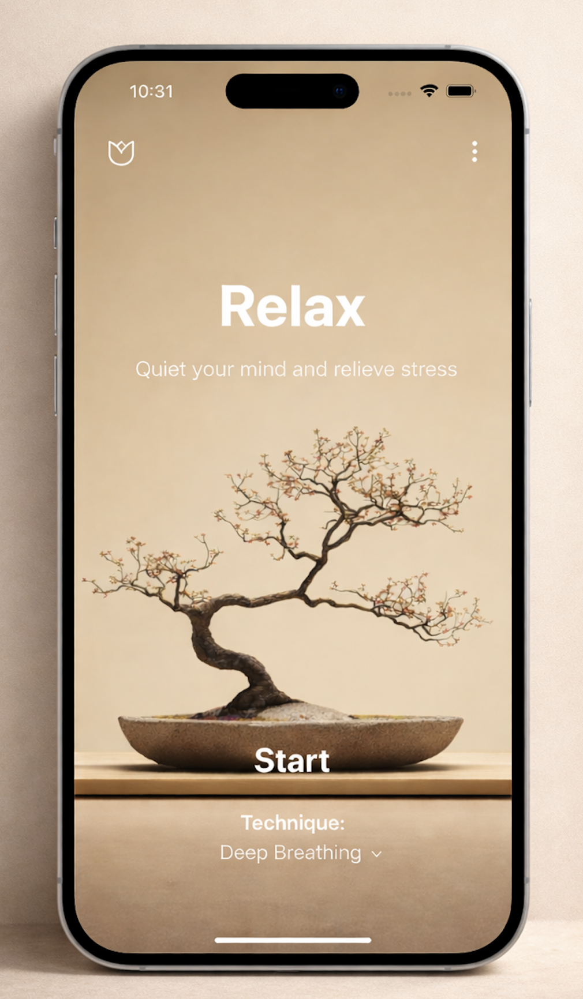
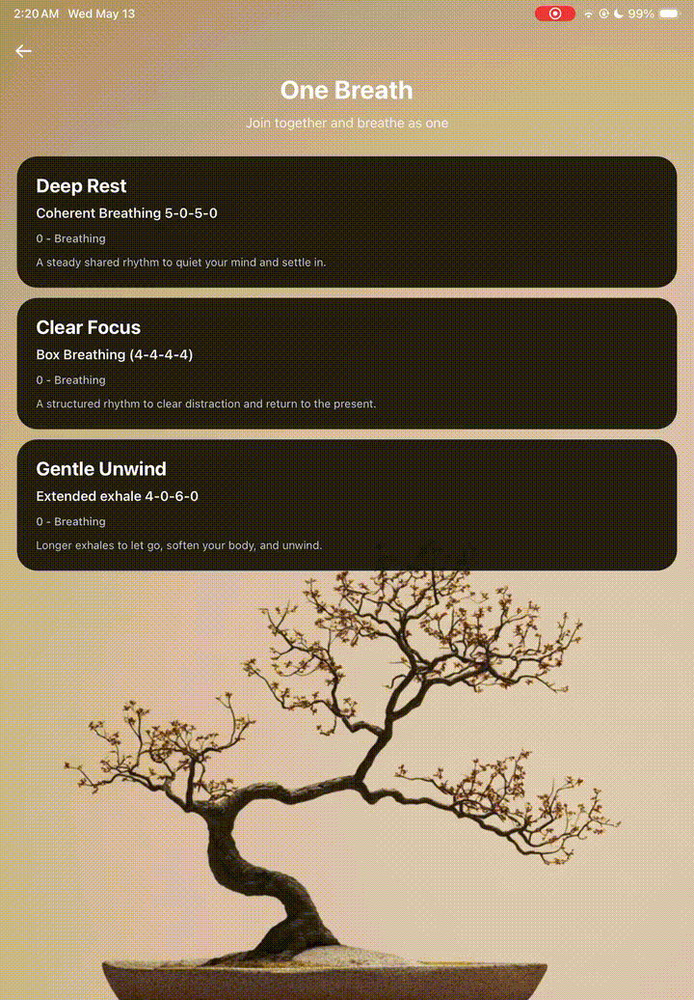
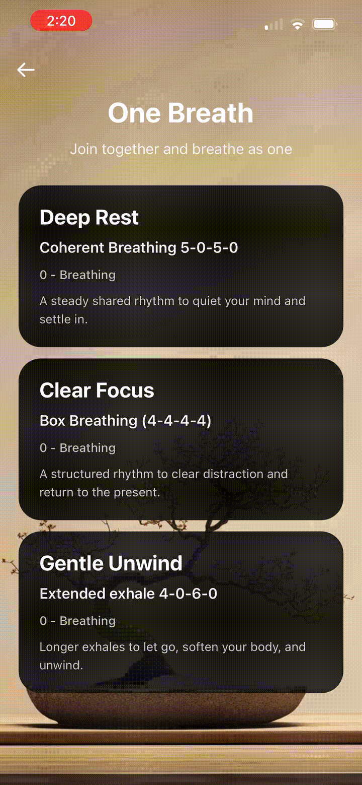
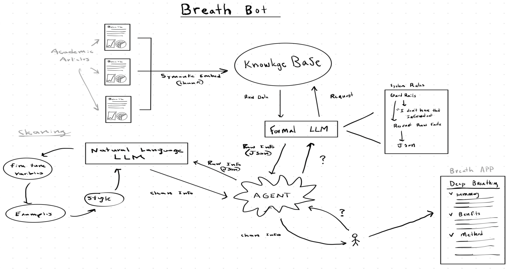

# JustBreatheBro
Mindfulness and breathing mobile app



## Thank you
JustBreatheBro is a personal project that deepened my mindfulness practice and pushed me to grow as an engineer, musician, and artist.

I hand-played and produced the meditation audio, designed the icons and animations, created the custom haptics, and built the app from the ground up.

This project means a lot to me. Thanks for checking it out.

## Quick links

- **App Store:** [Download JustBreatheBro](https://apps.apple.com/us/app/justbreathebro/id6756590863)
- **Google Play:** not live yet
- **BreathBot (content pipeline):** [github.com/michael-d-abraham/AIBreathBot](https://github.com/michael-d-abraham/AIBreathBot)
- **WebSocket backend (live sessions):** [github.com/michael-d-abraham/breatheAppWebSocketBackEnd](https://github.com/michael-d-abraham/breatheAppWebSocketBackEnd)

## Product preview

<p align="center">
  
</p>

---

## Core features

- **Guided sessions:** multiple breathing styles with methods and benefits.
- **Immersive experience:** custom animation + timed haptics + handcrafted audio cues.
- **Ambient soundscapes:** background audio to support longer sessions.
- **Information archive:** curated articles, videos, and books for mindfulness practice.
- **Live breathing rooms:** real-time synchronized sessions over WebSockets.

---

## Tech stack

| Layer | Technology |
|---|---|
| Framework | React Native `0.81` + Expo `~54` (Expo Router) |
| Animation | `react-native-reanimated` + `react-native-svg` |
| Audio | `expo-audio` |
| Haptics | `expo-haptics` |
| Storage | AsyncStorage |
| Realtime | WebSockets (Node service on Render) |
| Monitoring | Sentry |

Session flow, timers, animation, audio, and haptics are orchestrated through layered hooks
(`useBreathingCycle`, `useBreathingAnimation`, `useBreathingAudio`, `useBreathingHaptics`),
with global settings state in `contexts/`.

---

## Getting started

**Prerequisites:** Node.js, npm, Expo CLI (`npm install -g expo-cli`), and either Xcode (iOS) or Android Studio (Android).

```bash
# Install dependencies
npm install

# Start the Expo dev server
npm start

# Run on a specific platform
npm run ios        # requires Xcode
npm run android    # requires Android Studio
npm run web
```

---

## Scripts

| Script | Command | Notes |
|---|---|---|
| `npm start` | `expo start` | Starts the Expo dev server |
| `npm run ios` | `expo run:ios` | Build and run on iOS simulator / device |
| `npm run android` | `expo run:android` | Build and run on Android emulator / device |
| `npm run web` | `expo start --web` | Run in browser |
| `npm run lint` | `expo lint` | ESLint via Expo config |
| `npm test` | `jest` | Runs the Jest test suite |

---

## Project structure

```
app/          Expo Router routes (file-based Stack navigation)
components/   Presentational + bottom-sheet components
contexts/     App-wide state (settings, current exercise)
hooks/        Core logic (cycle, animation, audio, haptics, soundscape, live room)
lib/          Storage wrappers, archive CRUD, WebSocket config
constants/    Wallpaper images, theme color tables
utils/        Sentry analytics helpers
assets/       Sounds, soundscapes, backgrounds, icons
docs/         Architecture map, route audit, regression checklist, hook reviews
```

For the full map — folder contents, active routes, naming conventions, risky areas, and
refactor protocol — see [`AGENTS.md`](./AGENTS.md) and [`docs/ARCHITECTURE.md`](./docs/ARCHITECTURE.md).

---

## Testing and regression

```bash
npm run lint   # must exit 0
npm test       # 76 tests across 6 suites — all must pass
```

Before committing any change to session logic, audio, haptics, animation, navigation, or
settings, run the full manual checklist in [`docs/REGRESSION_CHECKLIST.md`](./docs/REGRESSION_CHECKLIST.md).

---

## External services

**Live rooms** are powered by a Node WebSocket service on Render. A single authoritative
breathing timer broadcasts to all participants, keeping the group synchronized in real time.

<p align="center">
  
  
</p>

- **Backend repo:** [github.com/michael-d-abraham/breatheAppWebSocketBackEnd](https://github.com/michael-d-abraham/breatheAppWebSocketBackEnd)

**Information Archive** content is generated and validated through **BreathBot** — a RAG-style
workflow grounded in hand-picked sources.



- **BreathBot repo:** [github.com/michael-d-abraham/AIBreathBot](https://github.com/michael-d-abraham/AIBreathBot)

---

## Art and audio

- **Visuals & icons:** Procreate
- **Music & sound design:** Logic Pro

---

*JustBreatheBro — Michael Abraham*
