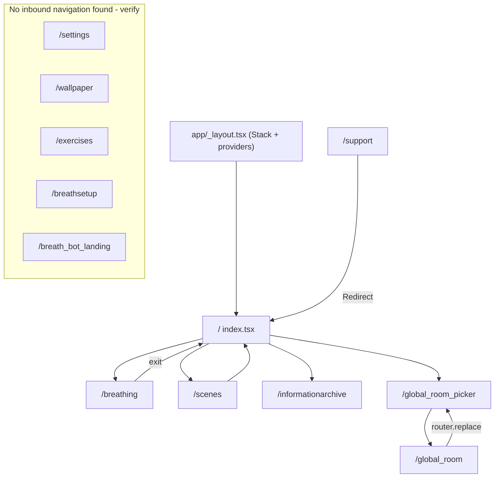
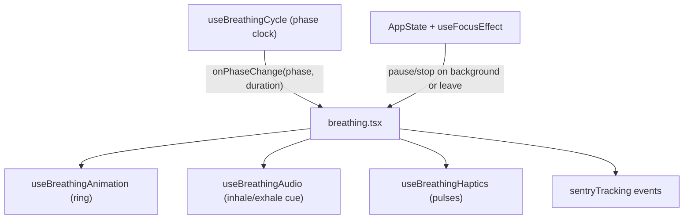
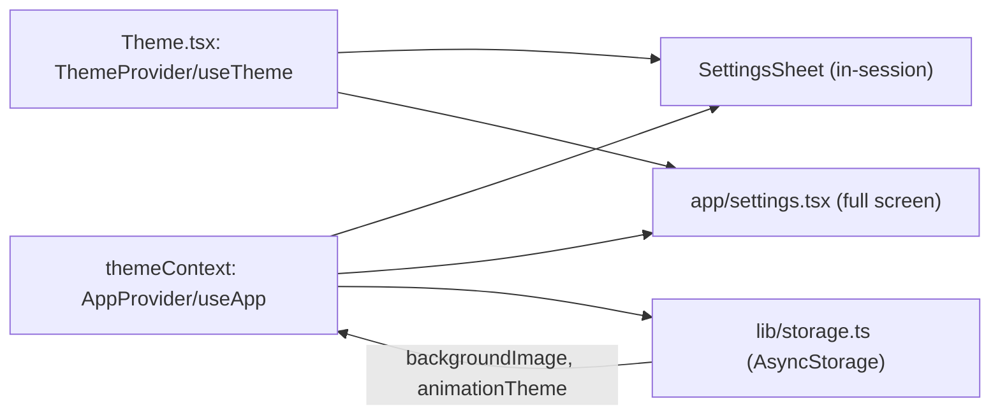
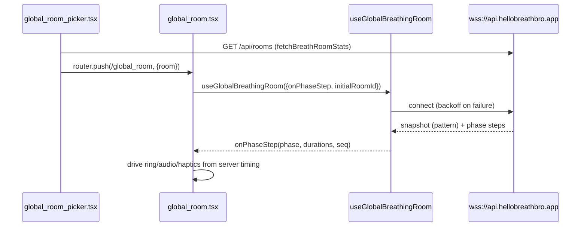

# JustBreatheBro — Architecture Map

> Status: descriptive snapshot of the codebase **as it exists today**. This document does not
> propose code changes; it records current reality so cleanup work has a shared source of truth.
> Where something looks unused, duplicated, or risky it is flagged explicitly and, where noted,
> should be verified before acting.

---

## 1. App purpose

JustBreatheBro is a mindfulness and breathing mobile app built with React Native + Expo
(Expo Router). Core capabilities:

- **Guided breathing sessions** — multiple breathing patterns driven by a phase state machine,
  layered with custom animation, hand-produced audio cues, and timed haptics.
- **Ambient soundscapes** — looping background audio that plays app-wide and survives navigation.
- **Information archive** — curated articles, books, and videos (content produced by the external
  BreathBot pipeline).
- **Live "Breathe Together" rooms** — real-time synchronized group sessions over WebSockets, with a
  single authoritative server timer broadcast to all participants.

Tech stack (see [package.json](../package.json), [app.json](../app.json)): Expo `~54`,
React Native `0.81`, `expo-router ~6`, `react-native-reanimated ~4`, `@gorhom/bottom-sheet`,
`expo-audio`, `expo-haptics`, AsyncStorage, and Sentry for monitoring. New Architecture and the
React Compiler are enabled (`newArchEnabled`, `experiments.reactCompiler` in `app.json`).

---

## 2. Folder structure

```
Breath/
  app/                 Expo Router routes (file-based routing)
    _layout.tsx        Root layout: Sentry init, audio mode, providers, Stack
    index.tsx          Home screen (ACTIVE entry)
    breathing.tsx      Solo breathing session screen (largest screen file)
    settings.tsx       Full-screen settings (see duplication note)
    scenes.tsx         Wallpaper / scene picker (ACTIVE)
    wallpaper.tsx      Alternate wallpaper carousel (orphan route, see section 3)
    informationarchive.tsx   Information archive browser
    global_room.tsx    Live "Breathe Together" room session screen
    global_room_picker.tsx   Live room selection screen
    breathsetup.tsx    Breath setup screen (orphan route, see section 3)
    breath_bot_landing.tsx   BreathBot landing (orphan route, see section 3)
    exercises.tsx      Exercise list screen (orphan route, see section 3)
    support.tsx        Legacy route -> Redirect to "/"
    _tabs/             Underscore-prefixed dir; appears EXCLUDED from routing (see section 3)
      _layout.tsx      Tab navigator referencing "learn"/"meditate" screens that do not exist
      index.tsx        Duplicate of app/index.tsx
      settings.tsx     Near-duplicate of app/settings.tsx

  components/          Presentational + sheet components
    Theme.tsx          Theme/token context (ThemeProvider, useTheme) + helpers
    BaseBottomSheet.tsx     Shared bottom-sheet contract
    BottomSheet*.tsx        Sheet building blocks + sheet-variant pickers
    SettingsSheet.tsx, SupportSheet.tsx, ExerciseDetailSheet.tsx, ExerciseSelectionSheet.tsx
    SoundPicker / SoundscapePicker / ThemePicker / AppearancePicker   "page" variant pickers
    BackgroundSoundscapePlayer.tsx   Mounts the app-wide soundscape hook (renders null)
    BreathingPage*.tsx, Scenes*.tsx, startbutton.tsx, theme_buttons.tsx, appearance_button.tsx, ...

  contexts/
    themeContext.tsx   App settings + wallpaper state (AppProvider, useApp) -- NOT theme tokens
    breathingContext.tsx   Current selected exercise (BreathingProvider, useBreathing)

  hooks/
    useBreathingCycle.ts      Phase state machine
    useBreathingAnimation.ts  Reanimated ring values
    useBreathingAudio.ts      Inhale/exhale cue playback
    useBreathingHaptics.ts    Phase-quantized haptic pulses
    useBreathingSheets.ts     Sheet open/close coordination for home/session
    useBackgroundSoundscape.ts  App-wide looping ambient audio
    useGlobalBreathingRoom.ts  Live room WebSocket state machine
    useSwipeNavigation.ts     Swipe gestures (currently unused, see section 10)
    __tests__/                Jest tests for cycle + global room

  lib/
    storage.ts                AsyncStorage wrappers + defaultExercises
    informationArchive.ts     Archive CRUD over AsyncStorage + JSON defaults
    informationArchive.json   Seed content
    breathRoomBackend.ts      WebSocket / HTTP endpoint config for live rooms
    breathingHapticsResolve.ts  Pure helper: pulse plan math

  constants/featureColors.ts  Theme preview color tables
  utils/sentryTracking.ts     Breathing analytics events (entered/started/exited)
  assets/                     Sounds, soundscapes, zenscape backgrounds, icons, readme media

  Config: app.json, eas.json, package.json, tsconfig.json, metro.config.js,
          jest.config.js, eslint.config.js, .cursorrules
  Docs:   README.md (marketing), project.md (legacy brainstorm), docs/ARCHITECTURE.md (this file)
```

---

## 3. Every route

Routing is file-based via Expo Router. The root navigator is a `Stack` defined in
[app/_layout.tsx](../app/_layout.tsx) (`animation: "none"`, headers hidden).

> Note on `app/_tabs/`: Expo Router ignores files and directories whose names begin with `_`
> (except `_layout.tsx` inside an active segment). Because the directory itself is named `_tabs`,
> the screens inside it appear to be **excluded from routing** and therefore inactive. The active
> home screen is [app/index.tsx](../app/index.tsx), not [app/_tabs/index.tsx](../app/_tabs/index.tsx).
> This should be verified empirically before any deletion.

| Route | File | Reachable from | Status |
|---|---|---|---|
| `/` | [app/index.tsx](../app/index.tsx) | App launch; `router.push('/')` from several screens | Active (home) |
| `/breathing` | [app/breathing.tsx](../app/breathing.tsx) | `index.tsx` start button (with `autoStart`), `exercises.tsx`, `breathsetup.tsx`, `_tabs/index.tsx` | Active |
| `/scenes` | [app/scenes.tsx](../app/scenes.tsx) | `index.tsx` (circle press), `wallpaper.tsx` | Active |
| `/informationarchive` | [app/informationarchive.tsx](../app/informationarchive.tsx) | `index.tsx` | Active |
| `/global_room_picker` | [app/global_room_picker.tsx](../app/global_room_picker.tsx) | `index.tsx` (global breath press), `global_room.tsx` (`router.replace`) | Active |
| `/global_room` | [app/global_room.tsx](../app/global_room.tsx) | `global_room_picker.tsx` (`router.push` with `params.room`) | Active |
| `/settings` | [app/settings.tsx](../app/settings.tsx) | No `router.push('/settings')` found; in-session settings use `SettingsSheet`, not this route | Likely orphan / verify |
| `/wallpaper` | [app/wallpaper.tsx](../app/wallpaper.tsx) | No inbound `router.push('/wallpaper')` found; it pushes `/scenes` | Likely orphan / verify |
| `/exercises` | [app/exercises.tsx](../app/exercises.tsx) | No inbound navigation found | Likely orphan / verify |
| `/breathsetup` | [app/breathsetup.tsx](../app/breathsetup.tsx) | No inbound navigation found | Likely orphan / verify |
| `/breath_bot_landing` | [app/breath_bot_landing.tsx](../app/breath_bot_landing.tsx) | No inbound navigation found | Likely orphan / verify |
| `/support` | [app/support.tsx](../app/support.tsx) | Deep link `/support`; renders `<Redirect href="/" />` | Legacy stub (intentional) |
| (n/a) | [app/_tabs/_layout.tsx](../app/_tabs/_layout.tsx) | References `learn`/`meditate` screen files that do not exist | Inactive (underscore dir) |
| (n/a) | [app/_tabs/index.tsx](../app/_tabs/index.tsx) | Duplicate of `app/index.tsx` | Inactive (underscore dir) |
| (n/a) | [app/_tabs/settings.tsx](../app/_tabs/settings.tsx) | Near-duplicate of `app/settings.tsx` | Inactive (underscore dir) |

Route map of the active surfaces:



---

## 4. Breathing flow (solo session)

Entry point: home [app/index.tsx](../app/index.tsx) → `handleStartPress()` calls
`updateExercise(displayExercise)` (from `useBreathing`) then
`router.push({ pathname: "/breathing", params: { autoStart: "true" } })`.

The session screen [app/breathing.tsx](../app/breathing.tsx) (~654 lines) is the orchestrator. It
composes four layered hooks plus context state. The cycle hook is the clock; the screen forwards
phase transitions to animation, audio, and haptics.

- **State machine** — [hooks/useBreathingCycle.ts](../hooks/useBreathingCycle.ts).
  `useBreathingCycle({ exercise, onPhaseChange, onCycleStart })` exposes phases
  `BreathingPhase = 'inhale' | 'hold1' | 'exhale' | 'hold2' | 'idle'`. It tracks `phase`,
  `timeLeft`, `isRunning`, `isPaused` plus refs (`phaseStartTimeRef`, `phaseDurationRef`,
  `remainingTimeRef`) to support pause/resume without drift. A 1-second `setTimeout` drives the
  visible countdown; an async `sleep()` that respects pause drives phase advancement.
- **Animation** — [hooks/useBreathingAnimation.ts](../hooks/useBreathingAnimation.ts). Reanimated
  shared values `radius` (66↔179) and `strokeWidth` (3↔6). API: `animateInhale`, `animateExhale`,
  `seekToPhaseProgress` (snap on resume), `pause`, `resume`, `reset`. Rendered as an
  `Animated` SVG `Circle` in the screen.
- **Audio cues** — [hooks/useBreathingAudio.ts](../hooks/useBreathingAudio.ts).
  `useBreathingAudio({ soundEnabled, isRunning, soundType })`. Loads separate inhale/exhale `.wav`
  files per `SoundType` (`synth | guzheng | sine`; `off` uses sine as an unplayed placeholder to
  keep hook order stable). Two `useAudioPlayer` instances at volume `0.3`.
- **Haptics** — [hooks/useBreathingHaptics.ts](../hooks/useBreathingHaptics.ts).
  `useBreathingHaptics({ hapticsEnabled })` returns `beginPhase` / `cancel`. Pulses are quantized
  across the phase via `resolvePhasePulsePlan` from
  [lib/breathingHapticsResolve.ts](../lib/breathingHapticsResolve.ts). A `generationRef` guards
  against stale scheduled pulses (idempotent cancel). Per-phase config lives in
  `BREATHING_PHASE_HAPTICS` in `breathing.tsx`; `hapticArgsForBreathingPhase()` maps a phase to
  `BeginBreathingPhaseHapticsArgs`.
- **Analytics** — [utils/sentryTracking.ts](../utils/sentryTracking.ts):
  `trackBreathingEntered`, `trackBreathingStarted`, `trackBreathingExited` (with
  `BreathingExitReason = 'user_exit' | 'unmount' | 'background'`).



Lifecycle safety (per `.cursorrules` invariants): the screen wires `AppState` and
`useFocusEffect` so that backgrounding or navigating away stops timers, audio, and haptics and
settles the animation. The cycle, haptics, and audio hooks are each designed to be idempotent on
stop/cancel.

---

## 5. Settings flow

App-wide settings and wallpaper live in [contexts/themeContext.tsx](../contexts/themeContext.tsx)
(`AppProvider`, `useApp`). Despite the file name, this is the **app settings** context, not the
visual token theme.

`AppSettings` shape: `soundEnabled`, `hapticsEnabled`, `animationsEnabled`, `backgroundType`,
`soundType` (`SoundType`), `soundscape` (`SoundscapeType`), `animationTheme` (`ThemeName`).
Exposed setters include `updateSettings`, `toggleSound`, `toggleHaptics`, `toggleAnimations`,
`setSoundType`, `setSoundscape`, `setAnimationTheme`, plus `backgroundImage` / `setBackgroundImage`.
Background image defaults to `DEFAULT_ZENSCAPE_BACKGROUND_FILENAME` resolved through
`ZENSCAPE_IMAGE_MAP` (static `require`s).

Visual tokens are a separate concern in [components/Theme.tsx](../components/Theme.tsx)
(`ThemeProvider`, `useTheme`): palette tokens, bottom-sheet tokens (`PlatformColor`-based), and the
breathing animation theme (`grounded | calm | uplifting`). Helpers include
`useBreathingAnimationTokens` and `useWallpaperForeground`.

Persistence runs through [lib/storage.ts](../lib/storage.ts) — `backgroundImage` and
`animationTheme` are saved/loaded; the remaining toggles are in-memory state in the provider.

Settings UI exists in three places that overlap:

- **In-session sheet** — [components/SettingsSheet.tsx](../components/SettingsSheet.tsx), opened from
  [app/breathing.tsx](../app/breathing.tsx) and [app/global_room.tsx](../app/global_room.tsx). Uses
  the `BottomSheet*` picker variants (`BottomSheetSoundPicker`, `BottomSheetSoundscapePicker`,
  `BottomSheetThemePicker`).
- **Full screen** — [app/settings.tsx](../app/settings.tsx). Uses the "page" picker variants
  (`SoundPicker`, `SoundscapePicker`, `ThemePicker`, `AppearancePicker`, `SoundHapticsPicker`).
- **Duplicate** — [app/_tabs/settings.tsx](../app/_tabs/settings.tsx) is nearly identical to
  `app/settings.tsx` (differs only in `@/` vs relative imports) and sits in the inactive `_tabs` dir.



---

## 6. Live room flow ("Breathe Together")

Selection screen [app/global_room_picker.tsx](../app/global_room_picker.tsx) lists rooms from
`BREATH_ROOM_CATALOG` (defined in [hooks/useGlobalBreathingRoom.ts](../hooks/useGlobalBreathingRoom.ts):
`deep` / `box` / `extended-exhale`) and fetches live participant counts via
`fetchBreathRoomStats(apiBase)` → `GET /api/rooms`. Tapping a room navigates
`router.push({ pathname: "/global_room", params: { room: opt.id } })`.

Session screen [app/global_room.tsx](../app/global_room.tsx) (~600 lines) consumes
`useGlobalBreathingRoom({ onPhaseStep, initialRoomId, onSelectedRoomIdChange })`. The hook is a
WebSocket-driven state machine:

- Endpoints from [lib/breathRoomBackend.ts](../lib/breathRoomBackend.ts): `getBreathRoomWsUrl()`
  (default `wss://api.hellobreathbro.app`, overridable via `EXPO_PUBLIC_BREATH_ROOM_WS_URL` /
  `EXPO_PUBLIC_WS_URL`) and `getBreathRoomApiBaseUrl()` (default
  `https://api.hellobreathbro.app`, overridable via `EXPO_PUBLIC_API_BASE_URL`).
- `BreathRoomConnectionState = 'idle' | 'connecting' | 'connected' | 'reconnecting' | 'disconnected'`.
- Server is authoritative for timing: the hook tracks `pattern` (`BreathRoomPattern`), `phase`
  (`GlobalRoomPhase`), `phaseSeq`, `phaseDurationMs`, `phaseEndsAtMs`, `offsetMs`, and
  `participantCount`, and emits `onPhaseStep(GlobalRoomPhaseStepPayload)` to the screen.
- Reconnect uses backoff (`INITIAL_CONNECT_BACKOFF_MS = 2000`, `MAX_RECONNECT_BACKOFF_MS = 45000`,
  jitter) so Render cold starts are not treated as failures. `skipBreathCueAudio` suppresses cue
  audio on the first step after (re)connect so sounds do not fire mid-phase against wall clock.
- Phase transitions are de-duplicated with `lastHandledRoomPhaseKeyRef` (phaseSeq can repeat across
  rooms).



---

## 7. Storage flow

Persistence is AsyncStorage, wrapped in two modules.

[lib/storage.ts](../lib/storage.ts) — keys: `breathing_exercises` (`EXERCISES_KEY`),
`current_exercise` (`CURRENT_EXERCISE_KEY`), `background_image` (`BACKGROUND_IMAGE_KEY`),
`animation_theme` (`ANIMATION_THEME_KEY`). Functions: `getExercises` / `saveExercises`,
`getCurrentExercise` / `saveCurrentExercise`, `getBackgroundImage` / `saveBackgroundImage`,
`getAnimationTheme` / `saveAnimationTheme`, plus `initializeStorage`, `resetStorage`,
`forceUpdateToDefaults`. `defaultExercises: Exercise[]` (Deep Breathing, Box Breathing, 4-7-8, ...)
is the seed data; `Exercise` carries `inhale/hold1/exhale/hold2` plus copy fields.

[lib/informationArchive.ts](../lib/informationArchive.ts) — key `information_archive`
(`ARCHIVE_KEY`), seeded from [lib/informationArchive.json](../lib/informationArchive.json) via
`defaultResources`. Full CRUD + query helpers: `getResources`, `saveResources`, `addResource`,
`updateResource`, `deleteResource`, `getResourceById`, `getResourcesByType`, `getResourcesByTags`,
`searchResources`, `initializeArchive`, `resetArchiveToDefaults`, `clearArchive`. `InformationResource`
includes an `AI_description` field intended for agent/LLM consumption.

Consumers: `breathingContext` loads/saves the current exercise; `themeContext` loads/saves
background image + animation theme; `useBreathingSheets` loads the exercise list; the archive screen
reads resources.

---

## 8. Critical hooks

| Hook | File | Responsibility | Notes |
|---|---|---|---|
| `useBreathingCycle` | [hooks/useBreathingCycle.ts](../hooks/useBreathingCycle.ts) | Phase state machine / clock | Has tests; drift + pause/resume logic; the rest of the session is driven from its callbacks |
| `useBreathingAnimation` | [hooks/useBreathingAnimation.ts](../hooks/useBreathingAnimation.ts) | Reanimated ring values | `seekToPhaseProgress` for resume snap |
| `useBreathingAudio` | [hooks/useBreathingAudio.ts](../hooks/useBreathingAudio.ts) | Inhale/exhale cue playback | Two `useAudioPlayer`s; placeholder source when `off` to keep hook order |
| `useBreathingHaptics` | [hooks/useBreathingHaptics.ts](../hooks/useBreathingHaptics.ts) | Phase-quantized pulses | `generationRef` guards stale timers; idempotent `cancel` |
| `useBreathingSheets` | [hooks/useBreathingSheets.ts](../hooks/useBreathingSheets.ts) | Coordinates detail/selection/support sheets on home + session | Owns refs + open/close state, loads exercises |
| `useBackgroundSoundscape` | [hooks/useBackgroundSoundscape.ts](../hooks/useBackgroundSoundscape.ts) | App-wide looping ambient audio | Mounted once via `BackgroundSoundscapePlayer` in `_layout.tsx`; native loop |
| `useGlobalBreathingRoom` | [hooks/useGlobalBreathingRoom.ts](../hooks/useGlobalBreathingRoom.ts) | Live room WebSocket state machine | ~482 lines; has tests; reconnect/backoff/dedupe |
| `useSwipeNavigation` | [hooks/useSwipeNavigation.ts](../hooks/useSwipeNavigation.ts) | Swipe gesture factory | No importers found; targets `/calm` and `/energize` routes that do not exist |

Single-instance rule: the ambient soundscape is mounted exactly once in
[app/_layout.tsx](../app/_layout.tsx) via
[components/BackgroundSoundscapePlayer.tsx](../components/BackgroundSoundscapePlayer.tsx) (which renders
`null`). Do not add competing global players.

---

## 9. External services

- **Sentry** — initialized in [app/_layout.tsx](../app/_layout.tsx) (`initSentryOnce`, DSN inline)
  and configured as an Expo plugin in [app.json](../app.json) (org `breath-bro`). PII-stripping in
  `beforeSend`; replays only on errors. Custom breathing events in
  [utils/sentryTracking.ts](../utils/sentryTracking.ts).
- **Live WebSocket backend** — `wss://api.hellobreathbro.app` (+ `GET /api/rooms`), configured in
  [lib/breathRoomBackend.ts](../lib/breathRoomBackend.ts), overridable via `EXPO_PUBLIC_*` env vars.
  Node service hosted on Render (per README). Separate repo: `breatheAppWebSocketBackEnd`.
- **BreathBot content pipeline** — external RAG workflow that generates/validates the information
  archive content seeded in [lib/informationArchive.json](../lib/informationArchive.json). Separate
  repo: `AIBreathBot`. The app consumes the output JSON only.
- **Expo / EAS** — build + OTA via `expo-updates` (`Updates.channel`), EAS project id in
  `app.json`. Audio session configured in `_layout.tsx` (`setAudioModeAsync`, background audio mode
  on iOS via `UIBackgroundModes: ["audio"]`).
- **App stores** — iOS live (App Store), Google Play not yet live (per README).

---

## 10. Risky areas

1. **Session lifecycle invariants** — timers/audio/haptics/animation in
   [app/breathing.tsx](../app/breathing.tsx) and the breathing hooks. Any change must preserve:
   idempotent start/pause/resume/stop, no duplicate timers across re-renders, full teardown on
   stop/unmount/navigation-away, and no double-triggered cues on re-render (see `.cursorrules`).
2. **Live room timing** — [hooks/useGlobalBreathingRoom.ts](../hooks/useGlobalBreathingRoom.ts) is
   large and timing-sensitive (reconnect backoff, phase dedupe, `skipBreathCueAudio`). Server is the
   clock; client must not introduce its own drift.
3. **Large files** — `breathing.tsx` (~654), `global_room.tsx` (~600), `useGlobalBreathingRoom.ts`
   (~482), `wallpaper.tsx` (~369). High cognitive load and merge risk.
4. **Navigation duplication / inactive code** — `app/_tabs/` appears excluded from routing (the
   underscore-prefixed directory), yet contains `index.tsx` (duplicate home) and `settings.tsx`
   (near-duplicate of `app/settings.tsx`), and `_tabs/_layout.tsx` references nonexistent
   `learn`/`meditate` screens. Confirm inactivity before changing.
5. **Unused gesture hook** — [hooks/useSwipeNavigation.ts](../hooks/useSwipeNavigation.ts) has no
   importers and points to nonexistent routes `/calm`, `/energize`.
6. **Orphan routes** — `settings.tsx`, `wallpaper.tsx`, `exercises.tsx`, `breathsetup.tsx`,
   `breath_bot_landing.tsx` have no inbound navigation found (deep links not ruled out).
7. **Duplicated picker components** — page vs sheet variants share large blocks of near-identical
   code (`SoundPicker` / `BottomSheetSoundPicker`, etc.).
8. **Duplicated data** — `WALLPAPER_IMAGES` is defined independently in
   [app/scenes.tsx](../app/scenes.tsx) and [app/wallpaper.tsx](../app/wallpaper.tsx).
9. **Confusing naming** — `contexts/themeContext.tsx` exports `useApp`/`AppProvider` (app settings,
   not theme), while `components/Theme.tsx` is the actual token theme context. Snake_case component
   files (`startbutton.tsx`, `theme_buttons.tsx`, `appearance_button.tsx`) break the PascalCase
   convention used elsewhere.
10. **Thin test coverage** — only `useBreathingCycle` and `useGlobalBreathingRoom` have tests
    (`hooks/__tests__`); audio, haptics, sheets, and storage are untested.
11. **Tooling drift** — [package.json](../package.json) `reset-project` script references
    `scripts/reset-project.js`, but no `scripts/` directory exists. A stray `dummy.ipynb` is present.
12. **Source-of-truth sprawl** — `README.md` (marketing), `project.md` (legacy brainstorm), and
    `.cursorrules` (partial AI guide) overlap. This document is intended to become the canonical map.

---

## 11. Suggested cleanup order

Each step should reduce total complexity (fewer files / fewer duplicate concepts / clearer
ownership) and be verifiable with `npm run lint`, `npm test`, and a manual core-flow check
(start session → pause/resume → exit; change settings; join/leave room).

1. **Confirm + resolve navigation reality** — verify whether `app/_tabs/` is routed; pick one home
   model and remove the dead duplicate (`_tabs/index.tsx`, `_tabs/settings.tsx`, `_tabs/_layout.tsx`).
2. **Remove dead code** — `useSwipeNavigation` (if still unimported) and any other unreferenced
   exports; decide on orphan routes (`settings`/`wallpaper`/`exercises`/`breathsetup`/
   `breath_bot_landing`): wire up, delete, or quarantine with a note here.
3. **Unify duplicated data** — single `WALLPAPER_IMAGES` source consumed by both `scenes.tsx` and
   `wallpaper.tsx`.
4. **Deduplicate pickers** — collapse page vs sheet picker pairs into one component with a variant,
   starting with Sound, then Soundscape, Theme, Appearance.
5. **Consolidate settings UI** — extract shared settings sections used by both `SettingsSheet` and
   the full-screen settings route.
6. **Clarify naming** — rename `themeContext`/`useApp` toward an app-settings name and bring
   snake_case component files to PascalCase (rename + re-export shims first).
7. **Break up god files** — extract presentational pieces from `breathing.tsx` and `global_room.tsx`
   along existing hook boundaries; trim `useGlobalBreathingRoom.ts`.
8. **Fix tooling** — restore or remove the `reset-project` script; remove stray files (`dummy.ipynb`).
9. **Expand tests** — add coverage for audio, haptics, sheets, and storage round-trips.
10. **Establish the AI source of truth** — promote this file (plus a concise `AGENTS.md`) to
    canonical; mark `project.md` non-authoritative; trim `.cursorrules` to guardrails that point here.

---

*This document describes current behavior only. Verify any "likely orphan" / "appears excluded"
item against a running build before removing code.*
