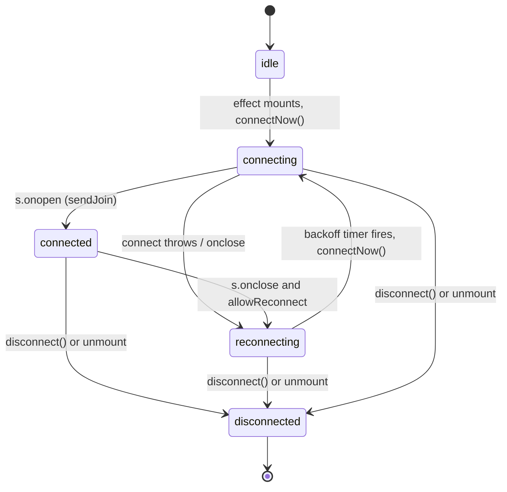

# `useGlobalBreathingRoom` — Code Review

Review of [`hooks/useGlobalBreathingRoom.ts`](../hooks/useGlobalBreathingRoom.ts).

This is a **review/documentation-only** artifact. No source code was changed. Line numbers reference the hook file at the time of review (~553 lines).

Primary consumer: [`app/global_room.tsx`](../app/global_room.tsx). Catalog/stats helpers are also used by [`app/global_room_picker.tsx`](../app/global_room_picker.tsx).

---

## 1. What the hook does

`useGlobalBreathingRoom` is the single client for the "Breathe Together" shared session. It owns one WebSocket connection and turns server messages into the connection, timing, and presence state the screen renders.

Responsibilities:

- **Connect + join**: opens a WebSocket to `getBreathRoomWsUrl()` and sends a `{ type: "join", room }` handshake; the server only starts emitting room events after that join.
- **Server-authoritative timing**: trusts only validated server phase payloads, syncs a local clock offset (`offsetMs`), and forwards each *new* phase transition to the caller's `onPhaseStep` callback for animation/audio/haptics. The hook itself does not run the breathing timer — it relays server truth.
- **Presence + pattern**: tracks `participantCount` and the room's breathing `pattern` from snapshot/presence messages.
- **Resilience**: auto-reconnects with exponential backoff + jitter, and exposes `connectionState` / `wsError` so the screen can render connecting/reconnecting/disconnected overlays.

It also exports standalone helpers that are **not** part of the hook's runtime state and are safe to call independently:

- `BREATH_ROOM_CATALOG`, `BREATH_ROOM_DEEP`, `BREATH_ROOM_BOX`, `BREATH_ROOM_EXTENDED_EXHALE`
- `getBreathRoomCatalogEntry`, `isCanonicalBreathRoomId`
- `fetchBreathRoomStats` (HTTP `GET /api/rooms`, used by the room picker)
- Re-exports `getBreathRoomApiBaseUrl`, `getBreathRoomWsUrl` from [`lib/breathRoomBackend.ts`](../lib/breathRoomBackend.ts)

### Message types consumed (`s.onmessage`, lines 436-461)

| `type` | Handler | Effect |
| --- | --- | --- |
| `snapshot` | `handleSnapshot` | Full state: `pattern`, `participantCount`, then delegates to `handlePhasePayload`. |
| `phase` | `handlePhasePayload` | Phase tick: validates and updates phase/seq/cycle/duration/endsAt, fires `onPhaseStep`. |
| `presence` | `handlePresence` | `serverTimeMs`, `roomId`, `participantCount` updates. |

---

## 2. Connection lifecycle

`BreathRoomConnectionState` (lines 133-138): `"idle" | "connecting" | "connected" | "reconnecting" | "disconnected"`.

Key mechanics, all inside one `useEffect` keyed on `wsUrl` (lines 338-498):

- **Initial connect**: on mount the effect resets dedupe refs, sets `allowReconnect = true`, `attempt = 0`, and calls `connectNow()` which sets `connecting` and constructs the socket.
- **Open** (`s.onopen`, lines 424-433): resets `attempt` to 0, sets `connected`, clears `wsError`, clears the three dedupe refs, then `sendJoin(s, selectedRoomRef.current)`.
- **Backoff** (`scheduleReconnect`, lines 368-385): `delay = min(MAX_RECONNECT_BACKOFF_MS, INITIAL_CONNECT_BACKOFF_MS * 2 ** attempt) + random()*BACKOFF_JITTER_MS`. Constants: initial `2000ms`, max `45000ms`, jitter `500ms`. Sets `reconnecting` and a generic "Connection lost — retrying…" message.
- **Close** (`s.onclose`, lines 468-476): nulls the socket refs; if reconnect is halted -> `disconnected`, otherwise -> `scheduleReconnect()`.
- **Stale-socket guard**: `onopen`/`onmessage`/`onerror`/`onclose` all bail when `wsRef.current !== s`, so events from a superseded socket are ignored after a reconnect.

The `wsUrl` is read once per render via `getBreathRoomWsUrl()` (line 336); since it is stable in practice, the connect effect effectively runs once per mount.

---

## 3. UI state managed inside the hook

State is split between values the screen actually reads and values that are computed/returned but currently unused.

### Returned values (lines 535-551)

| Returned | Backing state / source | Consumed by `global_room.tsx`? |
| --- | --- | --- |
| `connectionState` | `useState` (line 156) | Yes — overlays. |
| `wsError` | `useState` (line 158) | Yes — error banner / overlays. |
| `isConnected` | derived `=== "connected"` (line 533) | Yes — gates audio `isRunning`. |
| `participantCount` | `useState` (line 160) | Yes — header count. |
| `roomId` | `useState` (line 162) | Yes — catalog lookup. |
| `phase` | `useState` (line 166) | Yes — phase label. |
| `remainingMs` | `useMemo` (lines 523-526) | Yes — seconds countdown. |
| `disconnect` | `useCallback` (lines 528-531) | Yes — leave handler. |
| `pattern` | `useState` (line 161) | No. |
| `selectedRoomId` | `useState` (lines 163-164) | No. |
| `switchRoom` | `useCallback` (lines 500-515) | No. |
| `phaseSeq` | `useState` (line 167) | No. |
| `cycleIndex` | `useState` (line 168) | No. |
| `phaseDurationMs` | `useState` (line 169) | No. |
| `phaseEndsAtMs` | `useState` (line 170) | No. |

### Notable internal-only state

- `offsetMs` (line 171): server-clock offset = `serverTimeMs - Date.now()`, set via `applyServerTime`.
- `tick` (line 173): incremented every 200ms **only while `connected`** (lines 517-521) purely to re-drive the `remainingMs` memo.
- `remainingMs` (lines 523-526): `Math.max(0, phaseEndsAtMs - (Date.now() + offsetMs))`. It `void tick` to take a dependency on the ticker without using its value.

---

## 4. Cleanup / reconnect behavior

- **Halt mechanism**: `haltReconnects()` sets `allowReconnect = false` and clears the pending reconnect timer; `haltReconnectRef.current` additionally closes the socket if open (lines 351-365). This is the single shutdown path used by both user-leave and unmount.
- **Effect cleanup** (lines 487-497): calls `haltReconnects()`, nulls `haltReconnectRef`, closes the socket, and nulls `socket` / `wsRef.current`.
- **`disconnect()`** (lines 528-531): invokes `haltReconnectRef.current?.()` and forces `connectionState = "disconnected"`. Idempotent and safe to call repeatedly.
- **Dedupe refs reset on (re)connect** (lines 429-431, also 480-482): `lastHandledRoomPhaseKeyRef`, `lastStepRoomIdForAudioRef`, `lastServerRoomIdRef`.
  - Phase dedupe key is `` `${rId}:${pSeq}` `` (line 253). A repeated key is ignored so a single phase never triggers `onPhaseStep` twice; the same `phaseSeq` in a *different* room is treated as new.
  - `skipBreathCueAudio` is set true on the first step after a room change (`roomChangedForAudio`, lines 256-257, 272) so inhale/exhale cue audio does not fire out of sync with the wall clock immediately after connect/switch.
- **Room changes today happen via remount, not `switchRoom`**:
  - `GlobalRoomPage` ([`app/global_room.tsx`](../app/global_room.tsx) lines ~475-495) holds `sessionKey` and `sessionRoomId`. `onReconnect` bumps `sessionKey`, fully remounting `GlobalRoomInner` (and thus the hook).
  - The `initialRoomId` effect (lines 195-205) updates `selectedRoomId` and, if a socket is already open, re-sends `join` for the new room.
  - `switchRoom` (lines 500-515) is the intended in-place switch path but no consumer calls it (see Risks).

---

## 5. Risks

- **Dead in-place switch path**: `switchRoom` is not called by any consumer, so `onSelectedRoomIdChange` is effectively never invoked through it today. The whole in-place room-switch flow is unexercised and may hide latent bugs; room changes currently rely on remount + the `initialRoomId` effect instead.
- **Large unused return surface**: `pattern`, `selectedRoomId`, `switchRoom`, `phaseSeq`, `cycleIndex`, `phaseDurationMs`, `phaseEndsAtMs` are returned but unused. This invites confusion and accidental coupling, and makes the hook's true contract unclear.
- **`Date.now()` inside `useMemo`**: `remainingMs` reads `Date.now()` within a memo whose freshness depends on the `tick` interval. It works, but the dependency on interval cadence (200ms) is implicit/non-obvious, and the `void tick` pattern is a smell.
- **Error message clobbering**: `scheduleReconnect` always sets `wsError = "Connection lost — retrying…"`, which can briefly overwrite a more specific prior error (e.g. "Invalid WebSocket URL").
- **Unbounded `attempt` counter**: the *delay* is capped at 45s, but `attempt` and `2 ** attempt` keep growing across a long outage. Cosmetic (clamped by `Math.min`) but worth noting.
- **Many concerns in one file**: socket management, exponential backoff, clock sync, phase dedupe, presence, snapshot parsing, and the room catalog/stats helpers all live in one ~550-line module.
- **Thin test coverage**: existing tests ([`hooks/__tests__/useGlobalBreathingRoom.test.ts`](../hooks/__tests__/useGlobalBreathingRoom.test.ts)) cover only URL/config resolution in `breathRoomBackend`, not the hook's state machine, dedupe, or timing logic.

---

## 6. What should be extracted later

Suggestions only — no refactor is proposed or performed here.

- **Transport layer**: a `useBreathRoomSocket` (or plain class/util) that owns connect / backoff / stale-socket lifecycle and emits parsed messages, decoupled from React state.
- **Clock sync**: pull `offsetMs` + the `remainingMs` ticker into a small dedicated hook/util (e.g. `useServerClock`) so the countdown is testable in isolation and free of the `void tick` pattern.
- **Message decoding/validation**: move `asPhase`, `isRecord`, and the per-field payload guards into a typed decoder module that returns discriminated, validated message objects.
- **Catalog + stats**: move `BREATH_ROOM_CATALOG`, `getBreathRoomCatalogEntry`, `isCanonicalBreathRoomId`, and `fetchBreathRoomStats` into a dedicated `breathRoomCatalog` module, leaving the hook focused on live session state.

---

## 7. Suggested tests

State-machine and timing tests using a mock `WebSocket` and fake timers:

- **Phase dedupe**: a repeated `` `${roomId}:${phaseSeq}` `` does not double-fire `onPhaseStep`; the same `phaseSeq` under a new `roomId` does fire.
- **`skipBreathCueAudio`**: true only on the first step after a room change, false on subsequent steps in the same room.
- **Clock sync**: with a known `serverTimeMs`, `remainingMs` derives from `phaseEndsAtMs - (Date.now() + offsetMs)` and never goes negative; advancing fake time by the 200ms tick decreases it.
- **Reconnect/backoff**: `onclose` while `allowReconnect` schedules a retry with a growing-but-capped delay; `attempt` resets to 0 after a successful `onopen`.
- **`disconnect()`**: halts further retries and sets `connectionState = "disconnected"`; is idempotent.
- **Stale-socket guard**: messages delivered on a superseded socket (after reconnect) are ignored.
- **Snapshot parsing**: partial/invalid `pattern` and non-finite `participantCount` are rejected; valid values update `pattern`/`participantCount`.
- **Join handshake**: on open, a `{ type: "join", room }` is sent using `selectedRoomRef.current`; the `initialRoomId` effect re-sends `join` when the socket is already open.

---

_Review only — no code modified. See plan `Global Room Hook Review` for scope._
