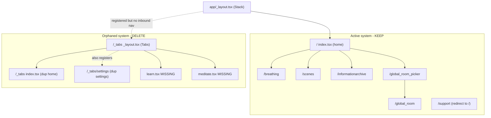

# Navigation Decision — Which Navigation System to Keep

> Recorded: 2026-06-23. Analysis only — no code was changed to produce this document.
>
> Scope requested: review `app/index.tsx`, `app/_tabs/index.tsx`, `app/_tabs/_layout.tsx`,
> `app/_tabs/settings.tsx`, determine whether duplicate navigation systems exist, and recommend the
> safest cleanup.
>
> **How this was verified:** Expo Router's generated [.expo/types/router.d.ts](../.expo/types/router.d.ts)
> was read to confirm which files are registered as routes, and every `app/` source file was read to
> confirm inbound `router.push` / `router.replace` / `<Link>` navigation.

---

## TL;DR

The app contains **two parallel home/navigation systems**:

1. **Active system** — a flat `Stack` defined in [app/_layout.tsx](../app/_layout.tsx) with
   [app/index.tsx](../app/index.tsx) as the home screen (route `/`). This is the system the running
   app actually uses.
2. **Orphaned system** — a `Tabs` navigator in [app/_tabs/_layout.tsx](../app/_tabs/_layout.tsx)
   wrapping a duplicate home ([app/_tabs/index.tsx](../app/_tabs/index.tsx)) and a duplicate settings
   screen ([app/_tabs/settings.tsx](../app/_tabs/settings.tsx)). It is **registered as real routes**
   (`/_tabs`, `/_tabs/settings`) but nothing in the app navigates to it, and its tab layout
   references screen files (`learn`, `meditate`) that **do not exist**.

**Recommendation: keep the active Stack system and delete the entire `app/_tabs/` directory.**

> Important correction to existing docs: [docs/ARCHITECTURE.md](./ARCHITECTURE.md) claims
> `app/_tabs/` is "EXCLUDED from routing" because of the leading underscore. **This is incorrect.**
> The generated `router.d.ts` registers `/_tabs` and `/_tabs/settings` as valid routes (see below).
> Underscore-prefixed *files* (`_layout.tsx`) are special conventions, but an underscore-prefixed
> *directory* like `_tabs/` is still a real, reachable route segment. This document follows the
> evidence in `router.d.ts`, which agrees with [docs/ROUTE_AUDIT.md](./ROUTE_AUDIT.md).

---

## 1. Current navigation structure

### Root layout

[app/_layout.tsx](../app/_layout.tsx) wraps the whole app in providers
(`ThemeProvider` → `AppProvider` → `BreathingProvider`), mounts a single global
`BackgroundSoundscapePlayer`, and defines navigation as a flat **`Stack`** (`RootContent`):

```115:130:app/_layout.tsx
      <Stack
        screenOptions={{
          headerShown: false,
          contentStyle: {
            backgroundColor: backgroundImage ? "transparent" : "transparent",
          },
          animation: "none",
        }}
      >
        <Stack.Screen
          name="breathing"
          options={{
            animation: "none",
          }}
        />
      </Stack>
```

Because it is a flat `Stack` with no nested group layout, every non-underscore file directly under
`app/` becomes a top-level route. The default/initial screen is `app/index.tsx` (route `/`).

### Active routes (the Stack system) and how they are reached

- `/` — [app/index.tsx](../app/index.tsx) — home; start session, pick technique, open archive,
  enter global room. Pushes to `/breathing`, `/scenes`, `/informationarchive`,
  `/global_room_picker`.
- `/breathing` — [app/breathing.tsx](../app/breathing.tsx) — solo session. Reached from `index.tsx`
  Start button (with `params.autoStart: "true"`).
- `/scenes` — [app/scenes.tsx](../app/scenes.tsx) — scene/soundscape/theme/appearance picker.
  Reached from `index.tsx` circle press.
- `/informationarchive` — [app/informationarchive.tsx](../app/informationarchive.tsx) — content
  archive. Reached from `index.tsx`.
- `/global_room_picker` — [app/global_room_picker.tsx](../app/global_room_picker.tsx) — choose a
  live room. Reached from `index.tsx`.
- `/global_room` — [app/global_room.tsx](../app/global_room.tsx) — live synchronized session.
  Reached from the picker.
- `/support` — [app/support.tsx](../app/support.tsx) — intentional legacy `<Redirect href="/" />`
  for old deep links.

### Registered-but-orphaned routes (not the focus, listed for completeness)

`/settings`, `/exercises`, `/wallpaper`, `/breathsetup`, `/breath_bot_landing` are all registered
routes with no inbound navigation. These are out of scope for this decision (covered in
[docs/ROUTE_AUDIT.md](./ROUTE_AUDIT.md)) and should **not** be touched as part of this cleanup.

### The second navigation system — `app/_tabs/`

[app/_tabs/_layout.tsx](../app/_tabs/_layout.tsx) defines a **`Tabs`** navigator with three tab
screens: `learn`, `index`, `meditate`.

```42:62:app/_tabs/_layout.tsx
      <Tabs.Screen
        name="learn"
        options={{
          title: 'Learn',
          tabBarLabel: 'Learn',
        }}
      />
      <Tabs.Screen
        name="index"
        options={{
          title: 'Breathe',
          tabBarLabel: 'Breathe',
        }}
      />
      <Tabs.Screen
        name="meditate"
        options={{
          title: 'Meditate',
          tabBarLabel: 'Meditate',
        }}
      />
```

Only `index.tsx` and `settings.tsx` exist inside `app/_tabs/`. There is **no** `learn.tsx` or
`meditate.tsx`, so two of the three declared tabs point at nonexistent files.

### Diagram



---

## 2. Duplicate or conflicting routes

Confirmed from [.expo/types/router.d.ts](../.expo/types/router.d.ts), both `/_tabs` and
`/_tabs/settings` are registered route entries alongside `/` and `/settings`.

- **Duplicate home screen** — `/_tabs` ([app/_tabs/index.tsx](../app/_tabs/index.tsx)) duplicates `/`
  ([app/index.tsx](../app/index.tsx)). The `_tabs` version is a strictly inferior, earlier copy:
  - Hardcodes "Deep Breathing" instead of reading `currentExercise` from `useBreathing()`.
  - No `BreathingPageHeader` (so no support / scenes / archive / global-room entry points).
  - No `ExerciseSelectionSheet` and no `SupportSheet` (only an `ExerciseDetailSheet`).
  - Does not pass `params.autoStart: "true"` when pushing to `/breathing`.
  - Uses `useBreathingSheets()` in the real home; the `_tabs` copy hand-rolls local sheet state.

  Behavioral diff:

  - Reads current exercise from context: `app/index.tsx` yes — `app/_tabs/index.tsx` no (hardcoded).
  - Exercise selection sheet: `app/index.tsx` yes — `app/_tabs/index.tsx` no.
  - Support sheet: `app/index.tsx` yes — `app/_tabs/index.tsx` no.
  - `BreathingPageHeader` with nav buttons: `app/index.tsx` yes — `app/_tabs/index.tsx` no.
  - `autoStart` param on Start: `app/index.tsx` yes — `app/_tabs/index.tsx` no.

- **Duplicate settings screen** — `/_tabs/settings` ([app/_tabs/settings.tsx](../app/_tabs/settings.tsx))
  is near-identical to `/settings` ([app/settings.tsx](../app/settings.tsx)). The only difference is
  import style: `_tabs/settings.tsx` uses `@/...` absolute imports, `app/settings.tsx` uses `../...`
  relative imports. Same components, layout, and styles otherwise.

- **Broken tab layout** — [app/_tabs/_layout.tsx](../app/_tabs/_layout.tsx) declares `learn` and
  `meditate` tab screens with no backing files. If `/_tabs` were ever navigated to, those tabs would
  be broken/missing.

- **Conflicting navigation paradigm** — the active app is a flat `Stack` (no bottom tab bar). The
  `_tabs` system introduces a `Tabs` bottom-bar paradigm that is inconsistent with the rest of the
  app and is never entered.

- **No conflict on the `/` route itself** — `/` resolves to `app/index.tsx`, not `app/_tabs/index.tsx`.
  The `_tabs` home is reachable only at the separate `/_tabs` path, which nothing links to. So there
  is no runtime collision today; the duplication is dormant dead code.

---

## 3. Recommended system to keep

**Keep the active flat `Stack` system rooted at [app/index.tsx](../app/index.tsx).**

Rationale:

- It is the system the app actually uses (default route `/`, all inbound navigation targets it).
- Its home screen is the complete, current implementation (context-driven exercise, full header,
  selection + support sheets, `autoStart`).
- The `_tabs` system is unreachable in practice, functionally behind, and partially broken (missing
  `learn`/`meditate` screens).
- Removing registered-but-unvisited routes is low risk: no inbound navigation depends on them.

**Delete the entire `app/_tabs/` directory.**

Do **not** delete `app/settings.tsx` as part of this task. Although it is itself an orphan (no
inbound nav), that is a separate decision tracked in [docs/ROUTE_AUDIT.md](./ROUTE_AUDIT.md) and
requires comparing it against the in-session `SettingsSheet` first. This cleanup is limited to the
duplicate `_tabs` navigation system.

---

## 4. Files that would be deleted or changed

### Deleted

- [app/_tabs/_layout.tsx](../app/_tabs/_layout.tsx) — orphaned `Tabs` navigator (references missing
  `learn`/`meditate`).
- [app/_tabs/index.tsx](../app/_tabs/index.tsx) — duplicate, inferior home screen.
- [app/_tabs/settings.tsx](../app/_tabs/settings.tsx) — near-duplicate of `app/settings.tsx`.

After deleting all three, the `app/_tabs/` directory is empty and should be removed entirely.

### Changed

- None required in source code. No file imports from `app/_tabs/*` (verified: the only references to
  `_tabs` / `learn` / `meditate` in the repo are inside the `_tabs` files themselves and in the docs).
- [.expo/types/router.d.ts](../.expo/types/router.d.ts) will regenerate automatically on the next
  Expo Router run and drop `/_tabs` and `/_tabs/settings`. It is a generated artifact — do not edit
  by hand.

### Documentation to update (optional but recommended)

- [docs/ARCHITECTURE.md](./ARCHITECTURE.md) — correct the inaccurate claim that `_tabs/` is excluded
  from routing, and mark the directory as removed once the deletion lands.

---

## 5. Risks

Overall risk: **Low.** The deleted routes have no inbound navigation and are not imported anywhere.

- **Lost deep links to `/_tabs` or `/_tabs/settings`** — Low. These were never advertised or linked.
  Unlike `/support` (which has an intentional redirect stub for legacy deep links), there is no
  evidence anything external relies on `/_tabs`. If desired, a `<Redirect href="/" />` stub could be
  added, but it is almost certainly unnecessary.
- **Hidden/manual navigation reference** — Low. A repo-wide search found no `router.push("/_tabs")`,
  `<Link href="/_tabs">`, or similar. Risk is only from strings constructed dynamically, which none
  were found.
- **Type errors from stale generated types** — Low/transient. `router.d.ts` is regenerated by Expo;
  a stale reference clears on the next dev-server start or typecheck.
- **Losing intended-but-unbuilt work** — Low/strategic. The `_tabs` system hints at a future
  Learn / Breathe / Meditate tab design. Deleting removes that scaffold. Mitigation: it is preserved
  in git history and can be restored if a tabbed redesign is pursued. The current files are not a
  usable starting point anyway (broken layout, outdated home copy).
- **`app/settings.tsx` confusion** — Low. Deleting the `_tabs` settings copy leaves only the root
  `app/settings.tsx`, which is itself orphaned. This cleanup does not resolve that; flag it so it is
  not mistaken for the fix.

---

## 6. Step-by-step implementation plan

> Execute only after this decision is approved. Each step is reversible via git.

1. **Pre-flight verification**
   - Confirm no inbound references: search the repo for `_tabs`, `"/learn"`, `"/meditate"`,
     `href="/_tabs`, `push("/_tabs`. Expect matches only inside `app/_tabs/*` and `docs/*`.
   - Confirm `learn.tsx` / `meditate.tsx` do not exist under `app/_tabs/`.

2. **Delete the duplicate navigation files**
   - Remove [app/_tabs/_layout.tsx](../app/_tabs/_layout.tsx)
   - Remove [app/_tabs/index.tsx](../app/_tabs/index.tsx)
   - Remove [app/_tabs/settings.tsx](../app/_tabs/settings.tsx)
   - Remove the now-empty `app/_tabs/` directory.

3. **Regenerate / refresh router types**
   - Start the dev server (or run typecheck) so Expo Router regenerates
     [.expo/types/router.d.ts](../.expo/types/router.d.ts); confirm `/_tabs` and `/_tabs/settings`
     are gone and no other route entries changed.

4. **Static checks**

```bash
npm run lint
npm test
npx tsc --noEmit   # if a typecheck script/path is available
```

5. **Manual smoke test (active Stack must be unchanged)**
   - App launches to the home screen (`/`, `app/index.tsx`).
   - Start button begins a session at `/breathing` (with auto-start).
   - Header buttons open: scenes (`/scenes`), information archive (`/informationarchive`),
     global room picker (`/global_room_picker`), and the support sheet.
   - Technique selector opens `ExerciseSelectionSheet`; selecting an exercise updates the home label.
   - Back navigation from each screen returns to home.

6. **Update docs**
   - Correct the `_tabs` routing claim in [docs/ARCHITECTURE.md](./ARCHITECTURE.md) and note the
     directory was removed. Cross-link this decision.

7. **Commit (only when asked)**
   - Single focused commit, e.g. `chore(nav): remove orphaned _tabs duplicate navigation system`.
   - Keep `app/settings.tsx`, `app/exercises.tsx`, `app/wallpaper.tsx`, `app/breathsetup.tsx`,
     `app/breath_bot_landing.tsx` untouched — those are separate decisions.

### Rollback

If anything regresses, `git revert` the deletion commit (or `git checkout` the three files from the
prior commit). The `_tabs` system is fully self-contained, so restoration is clean.
